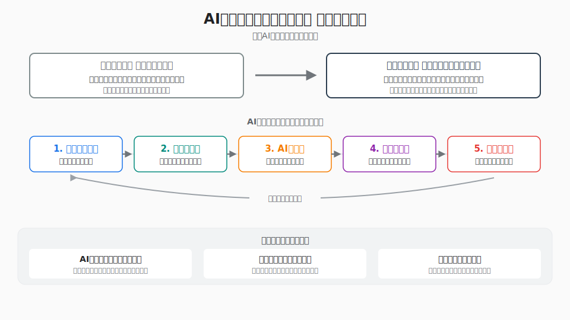

# AIとクリエイティブと教育

> 生成AI時代の創造性、表現、情報リテラシー、教育実践を横断的に検討する公開レポート集。

このリポジトリは、教育関係者および教育ソリューション提供企業が、生成AI時代の教育実践を検討するための公開資料集です。人間が読みやすいMarkdown本文と、AIエージェントやRAGで扱いやすいメタデータを併置しています。

*AIとクリエイティブと教育の概念図*

## 著者

### 東京大学 大学院情報学環・学際情報学府

- 教授 [渡邉英徳](https://researchmap.jp/hwtnv)
- 特任准教授 [原田真喜子](https://researchmap.jp/kokima)（都留文科大学 地域交流研究センター 特任講師）
- 博士後期課程 [小松尚平](https://researchmap.jp/komanbe)
- 博士後期課程 [片山実咲](https://researchmap.jp/misaki_katayama)
- 博士後期課程 [楊欽](https://researchmap.jp/kevinyang)
- 博士後期課程 [森吉蓉子](https://researchmap.jp/ymoriyos)

### 同志社大学 文化情報学府

- 准教授 [大井将生](https://researchmap.jp/m-oi)

## AI協働ツール

- ChatGPT（OpenAI）: GPT-5.5
- Gemini（Google）: Gemini 3.1 Pro
- Codex（OpenAI）: GPT-5.5
- GitHub Copilot（GitHub）: GPT-5.5

## レポート一覧

- [AIとクリエイティブと教育 総括レポート](reports/00-overview.md): 生成AIによって創作・開発・調査・表現のハードルが下がるなか、教育の焦点が個別技能の習熟から、問いの設定、資料の読解、倫理的判断、社会的価値への接続へ移ることを総括する。七篇の実践を通じて、AIを効率化ツールではなく、学習者の構想力・編集力・批判的思考を拡張する伴走者として位置づける。
- [AIと情報可視化・OSINT教育](reports/01-information-visualization-osint.md): 東京大学の情報メディア教育を軸に、データ可視化、デジタルアーカイブ、OSINTを組み合わせ、公開情報を検証可能な形で読み解き社会へ伝える学習モデルを示す。生成AIは結論を代行するのではなく、観察結果の言語化、仮説比較、推論の飛躍の点検を支える対話的な編集者として位置づけられる。
- [AIによるモノクロ写真カラー化を活かした高校生の平和教育実践](reports/02-photo-colorization-peace-education.md): 長崎東高校の写真集制作を事例に、AIによる白黒写真カラー化を、過去を正確に復元する処理ではなく、証言・専門知・地域の記憶と照合しながら歴史を自分ごと化する探究として捉える。AIリテラシー、資料批判、平和教育、社会発信を結び、若い世代が記憶を継承し対話を生む実践モデルを示す。
- [AIを活かしたデジタルシティズンシップ教育](reports/03-digital-citizenship.md): 生成AI時代のデジタルシティズンシップ教育を，禁止や管理ではなく，AIがある社会でどう判断し参加するかを学ぶ教育として再定義する。AI出力の検証，情報環境の読解，知識の再編集と共有を通じて，公共的価値を生み出す市民性を整理する。
- [AI時代の学生ハッカソン：実装の民主化と発想力への転換](reports/04-student-hackathon.md): 生成AIによってコード生成、UI設計、デバッグ、発表資料作成まで支援されることで、学生ハッカソンの重心が実装技能から課題設定、体験設計、社会的価値の構想へ移ることを論じる。Hack-1グランプリやメディアハッカソンを事例に、AIを伴走者として使いながら発想を形にし、人間が検証・編集する開発教育の姿を示す。
- [デジタルアーカイブとAIを活かした教育実践](reports/05-digital-archive-ai.md): デジタルアーカイブを資料保存の基盤にとどめず、学習者が問いを立て、資料を選び、AIの支援も用いて意味を構成し社会へ伝える探究環境として捉える。ジャパンサーチ、AIカラー化教材、S×UKILAM連携を通じて、一次資料性と生成AIの利便性を組み合わせた教育実践の可能性を整理する。
- [生成AIを用いたSFプロトタイピング](reports/06-sf-prototyping.md): 生成AIを用いて未来社会の物語や世界観を短時間で立ち上げ、参加者がそれを批判・修正・再構成するSFプロトタイピング手法を示す。専門家不在でも未来構想を民主化し、教育、産学協創、業務改革において人間の想像力、批判力、合意形成力を拡張する方法として位置づける。
- [AIとMinecraft教育：遊びの空間を，記憶・創造・AIリテラシーの学びへ](reports/07-minecraft-ai-education.md): Minecraftを，子どもや若者が世界を構築し，過去を再現し，未来を構想する学習環境として捉える。Peacecraft系ワークショップ，災害復興や地域学習，Microsoft・4-H・BBC・Code.orgによるAIリテラシー教材を横断し，AIを用いた記憶継承，創造，批判的リテラシーの学びを整理する。

## AIに読ませる場合

- 概念整理には [`assets/00-overview/project-concept-map.svg`](assets/00-overview/project-concept-map.svg) と、各レポートの構造化メタデータ `concept_alignment` を参照してください。
- まず [`llms.txt`](llms.txt) を読ませると、資料群の全体像と重要ファイルを短く把握できます。
- 続いて [`llms-full.md`](llms-full.md) を読ませると、各レポートの要約、テーマ、参照先をまとめて利用できます。
- 検索・RAG用途では [`metadata/chunks.jsonl`](metadata/chunks.jsonl) を使うと、見出し単位の分割済みテキストとして扱えます。
- `concept_alignment` の固定語彙は [`metadata/concept-schema.json`](metadata/concept-schema.json) で確認できます。
- 用語の揺れを抑えるには [`metadata/glossary.json`](metadata/glossary.json) を、図版を根拠付きで扱うには [`metadata/figures.json`](metadata/figures.json) を併用してください。
- 授業案、ワークショップ、サービス企画、根拠付き回答には [`prompts/`](prompts/) のプロンプトを利用できます。

## ライセンス

本文とメタデータは、特記がない限り `CC BY 4.0` で公開します。利用時は著者・出典を表示してください。
