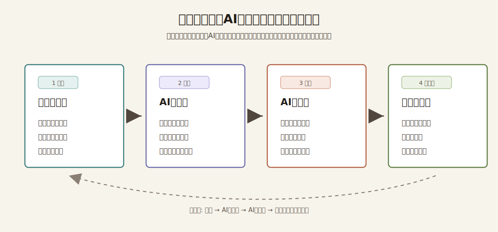

# AIとクリエイティブと教育

> 東京大学大学院 渡邉英徳研究室と関係者の実践・研究リソースをもとに、生成AI時代の創造性教育をヒトとAIに扱いやすいかたちで提供する公開レポート集。

本リポジトリは、東京大学大学院 渡邉英徳研究室と関係者が蓄積してきた、AI・クリエイティブ・教育に関する研究資料、実践記録、参考文献をもとにした公開レポート集です。生成AIが資料群を整理し、著者との対話を通じて論点を編み直し、ヒトが根拠、文脈、表現を確認しながらMarkdown本文として編集しています。

このリポジトリには、二つの入口があります。一つは、ヒトが読むための文章です。`index.html`、`README.md`、`reports/` は、生成AI時代の授業、探究学習、ワークショップ、教育サービス企画を考えるために読みやすく整えています。もう一つは、AIに読み込ませるためのデータパッケージです。`ai/manifest.json`、`ai/system-instructions.md`、`ai/rag/chunks.jsonl`、`metadata/report-sidecars/`、`references/` は、AIエージェント、AI読解ツール、RAGが本文、メタデータ、検索用チャンク、出典をたどれるようにまとめています。

基本的な使い方は、先にヒトが全体像を読み、次にAIへデータパッケージを読み込ませ、そのあと `prompts/` のプロンプトで授業案、研修案、サービス企画、ロードマップを作る流れです。AIの出力は完成品ではなく、本文と参考文献に照らしてヒトが検証し、目的に合わせて編集するためのたたき台として扱います。



*ヒト向けの文章とAI向けデータパッケージの使い方*

## 使い方の流れ

1. `index.html` または `README.md` で全体像を読む。
2. 必要に応じて `reports/` の個別レポートを読み、使いたいテーマを決める。
3. AI読解ツールや対話型生成AIに `ai/system-instructions.md` と `ai/context-brief.md` を渡す。全文をまとめて読み込ませる場合は `ai/notebooklm-source.txt` を使う。
4. 目的に近い `prompts/` のプロンプトを貼り付け、学年、教科、対象者、時間数、成果物などの条件を加える。
5. 出力された授業案、研修案、企画案、ロードマップを、レポート本文、メタデータ、参考文献に照らして確認し、ヒトが編集する。

このREADMEは、ヒトが目的に合うファイルをすばやく見つけるための案内であり、同時に、リポジトリごと読み込んだAIが構造、内容、利用法を理解するための入口です。


*AIとクリエイティブと教育の概念図*

## まず使うファイル

| 目的 | 使うファイル | 内容 |
| --- | --- | --- |
| ヒトが資料を読む | [`index.html`](index.html) | レポート、プロンプト、ソースコードへの入口をブラウザで読みやすく表示する閲覧アプリ |
| ヒトが全体像を把握する | [`README.md`](README.md) | このリポジトリの目的、構造、利用法、主要リソースの案内 |
| AIに最初の案内を渡す | [`ai/llms.txt`](ai/llms.txt) | AI向けの短い索引と重要ファイル一覧 |
| AIにレポート群の要約を渡す | [`ai/llms-full.md`](ai/llms-full.md) | 各レポートの要約、テーマ、利用想定、メタデータの統合版 |
| AIに読解ルールを渡す | [`ai/system-instructions.md`](ai/system-instructions.md) | 読む順序、回答ルール、推測や引用の扱い |
| AIにパッケージ全体を知らせる | [`ai/manifest.json`](ai/manifest.json) | 正本、派生ファイル、sidecar、RAGチャンクの索引 |
| AIに短い全体像を渡す | [`ai/context-brief.md`](ai/context-brief.md) | 最初に読むプロジェクト概要とレポート一覧 |
| AIに詳しい全体像を渡す | [`ai/context-full.md`](ai/context-full.md) | レポート別の要旨、示唆、活用場面、実装案 |
| AIに実行手順を選ばせる | [`ai/workflows.json`](ai/workflows.json) | プロンプト別の必要資料、入力項目、出力項目、根拠ルール |
| AI読解ツールに全文を渡す | [`ai/notebooklm-source.txt`](ai/notebooklm-source.txt) | レポート本文、プロンプト、メタデータ、参考文献をまとめた単一テキスト |
| レポート本文を読む、編集する | [`reports/`](reports/) | 各レポートの一次ソース。今後の本文更新はここを直接編集 |
| 授業案や企画案を生成する | [`prompts/`](prompts/) | 利用目的別のプロンプト例 |
| RAGや検索に使う | [`ai/rag/chunks.jsonl`](ai/rag/chunks.jsonl) | 根拠、用途、リスク注記を付けたAI向けチャンク |
| レポート単位で構造化する | [`metadata/report-sidecars/`](metadata/report-sidecars/) | 本文正本、図版、文献、節構造を結ぶsidecar |

## ディレクトリ構成

| パス | 役割 |
| --- | --- |
| [`ai/`](ai/) | AIに渡す入口ファイル、統合テキスト、AI向け概説、引用索引、RAGチャンク |
| [`reports/`](reports/) | レポート本文の一次ソース |
| [`prompts/`](prompts/) | 授業案、企画案、比較、根拠付き回答などのプロンプト例 |
| [`web/`](web/) | レポート・プロンプト閲覧アプリのCSSとJavaScript |
| [`metadata/`](metadata/) | 検索、RAG、AIエージェント向けの構造化データとレポート別sidecar |
| [`references/`](references/) | 参考文献・関連資料 |
| [`assets/`](assets/) | 図版・画像などの視覚資料 |
| [`config/`](config/) | レポート定義、参照情報、補助設定 |
| [`templates/`](templates/) | レポート作成時のテンプレート |
| [`scripts/`](scripts/) | AI向け構造化パッケージ、単一テキスト、閲覧アプリ索引の更新スクリプト |
| [`.githooks/`](.githooks/) | 自動更新用のGitフック |
| [`requirements/`](requirements/) | AI向け生成処理に必要な依存関係 |

## このリポジトリでできること

ヒトの読者は、次の用途で使えます。

- [`index.html`](index.html) からレポートを読み、必要なプロンプトや公開リポジトリ上のソース一式へ移動する。
- 生成AIが教育、創造性、平和学習、情報リテラシー、デジタルアーカイブ、未来構想に与える影響を横断的に理解する。
- 授業、探究学習、ワークショップ、教員研修、教育サービス企画の論点整理に使う。
- 総括レポートから読み始め、関心に近い個別レポートへ進む。

AIやRAGでは、次の用途で使えます。

- AI読解ツールや対話型生成AIに読み込ませ、レポートに根拠を置いた授業案、企画案、比較表、ロードマップを作る。
- `ai/rag/chunks.jsonl`、`metadata/report-sidecars/`、`metadata/reports.json`、`metadata/concept-schema.json` を使って、検索、RAG、AIエージェント向けの知識ベースを組む。
- `prompts/` のプロンプトを使い、出典付き回答、授業案、サービス企画、アイデア発想を行う。
- 回答時に、本文、メタデータ、参考文献のどこに根拠があるかを確認する。

## レポート一覧

各レポートの一次ソースは [`reports/`](reports/) 配下のMarkdownファイルです。

| レポート | 主なテーマ | 使いどころ |
| --- | --- | --- |
| [AIとクリエイティブと教育 総括レポート](reports/00-overview.md) | 生成AI、創造性、教育実践、総括 | 全体方針、研修導入、横断的な論点整理 |
| [AIと情報可視化・OSINT教育](reports/01-information-visualization-osint.md) | 情報可視化、OSINT、探究学習、メディアリテラシー | 公開情報検証、データ可視化、調査型授業 |
| [AIによるモノクロ写真カラー化を活かした高校生の平和教育実践](reports/02-photo-colorization-peace-education.md) | 写真カラー化、平和教育、歴史学習、記憶継承 | 平和学習、資料批判、社会発信型プロジェクト |
| [AIを活かしたデジタルシティズンシップ教育](reports/03-digital-citizenship.md) | デジタルシティズンシップ、AIリテラシー、公共性 | AI利用ルール、情報倫理、市民性教育 |
| [AI時代の学生ハッカソン：実装の民主化と発想力への転換](reports/04-student-hackathon.md) | ハッカソン、プロトタイピング、発想力、実装支援 | 学生開発、PBL、アイデア実装型教育 |
| [デジタルアーカイブとAIを活かした教育実践](reports/05-digital-archive-ai.md) | デジタルアーカイブ、一次資料、教材共創 | アーカイブ活用、地域学習、教材開発 |
| [生成AIを用いたSFプロトタイピング](reports/06-sf-prototyping.md) | 未来構想、SFプロトタイピング、合意形成 | 未来ワークショップ、企業研修、政策構想 |
| [AIとMinecraft教育：遊びの空間を，記憶・創造・AIリテラシーの学びへ](reports/07-minecraft-ai-education.md) | Minecraft、記憶継承、創造、AIリテラシー | 仮想空間学習、地域再現、防災・平和教育 |

## プロンプト例

各プロンプトは [`prompts/`](prompts/) にあります。AI読解ツールや対話型生成AIに `ai/system-instructions.md`、`ai/context-brief.md`、`ai/rag/chunks.jsonl`、`metadata/report-sidecars/`、`reports/` を読み込ませたうえで、目的に近いプロンプトを貼り付けて使ってください。単一ファイルで渡したい場合は、互換パッケージとして `ai/notebooklm-source.txt` を使えます。

| プロンプト | 用途 |
| --- | --- |
| [授業案生成プロンプト](prompts/lesson-plan-generation.md) | 学年、教科、時間数に合わせた授業案を作成する |
| [ワークショップ設計プロンプト](prompts/workshop-design.md) | 学校、自治体、企業研修向けの半日または1日のワークショップを設計する |
| [教育サービス企画プロンプト](prompts/service-planning.md) | EdTechや教育ソリューションのサービス案を整理する |
| [アイデア創出プロンプト](prompts/idea-generation.md) | レポート群をもとに新しい授業、教材、サービス、活動案を発想する |
| [エクスカーション法アイデア創出プロンプト](prompts/excursion-ideation.md) | 遠い領域の特徴を借りて発想を広げる |
| [実装ロードマップ生成プロンプト](prompts/implementation-roadmap.md) | 30日、90日、180日の導入計画を作る |
| [レポート横断比較プロンプト](prompts/cross-report-comparison.md) | 複数レポートの共通点、差異、補完関係を比較する |
| [根拠付き回答プロンプト](prompts/citation-answering.md) | `ai/rag/chunks.jsonl` などを根拠に、出典付きで回答する |
| [計画立案テンプレート](prompts/planning-template.md) | 授業、研修、企画を手早く構造化するための空欄テンプレート |

## ウェブアプリで読む

[`index.html`](index.html) は、ヒトの読者がレポートとプロンプトを読みやすい順序でたどるための静的な閲覧アプリです。トップページでは、研究・実践リソースを生成AIとの対話で編集した資料群であることを説明し、概念図、レポート、プロンプト、公開リポジトリ上のソース一式へ案内します。プロンプトは、先にリポジトリ全体または [`ai/notebooklm-source.txt`](ai/notebooklm-source.txt) をAIに提供したうえで使う流れにしています。

ローカルで確認する場合は、ブラウザのセキュリティ制約を避けるためHTTPサーバ経由で開いてください。

```sh
python3 -m http.server 8765
```

起動後、`http://127.0.0.1:8765/` を開きます。

Markdownファイルを追加・削除した場合は、次を実行して閲覧アプリの文書一覧を更新します。

```sh
scripts/update_web_manifest.sh
```

## AI向けデータパッケージの使い方

AIにリポジトリを読ませるときは、資料そのものと依頼文を分けて扱うと安定します。先にデータパッケージを読み込ませ、AIが読む順序、レポート本文、メタデータ、引用、図版、検索用チャンクを参照できる状態にします。そのあとで、`prompts/` のプロンプトを使って、授業案、研修案、サービス企画、比較表、ロードマップなどの出力形式を指定します。

用途に応じて、最初に渡す資料を選びます。

1. 読む順序と回答ルールを指定する場合: [`ai/system-instructions.md`](ai/system-instructions.md)
2. 全体像だけ必要な場合: [`ai/context-brief.md`](ai/context-brief.md)
3. レポート群の詳しい要約と用途が必要な場合: [`ai/context-full.md`](ai/context-full.md)
4. 目的に合うプロンプトと必要資料を選ぶ場合: [`ai/workflows.json`](ai/workflows.json)
5. AI読解ツールで全文検索・質問応答をしたい場合: [`ai/notebooklm-source.txt`](ai/notebooklm-source.txt)
6. RAGや検索システムに組み込む場合: [`ai/rag/chunks.jsonl`](ai/rag/chunks.jsonl)
7. 出典や図版も扱う場合: [`ai/citations.json`](ai/citations.json)、[`metadata/report-sidecars/`](metadata/report-sidecars/)、[`metadata/figures.json`](metadata/figures.json)

次に、目的に近いプロンプトを選びます。

| 作りたいもの | 使うプロンプト |
| --- | --- |
| 授業案 | [`prompts/lesson-plan-generation.md`](prompts/lesson-plan-generation.md) |
| 半日または1日の研修・ワークショップ | [`prompts/workshop-design.md`](prompts/workshop-design.md) |
| 教育サービスやEdTech企画 | [`prompts/service-planning.md`](prompts/service-planning.md) |
| 新しい授業・教材・活動のアイデア | [`prompts/idea-generation.md`](prompts/idea-generation.md) |
| 実装までのロードマップ | [`prompts/implementation-roadmap.md`](prompts/implementation-roadmap.md) |
| 複数レポートの比較 | [`prompts/cross-report-comparison.md`](prompts/cross-report-comparison.md) |
| 出典付きの回答 | [`prompts/citation-answering.md`](prompts/citation-answering.md) |

AIには、たとえば次のように指示してください。

```text
この資料群は「AIとクリエイティブと教育」に関する公開レポート集です。
東京大学大学院 渡邉英徳研究室と関係者の実践・研究リソースをもとに、生成AIとの対話を通じて編集されています。
回答では reports/ の本文、ai/rag/chunks.jsonl、ai/citations.json、metadata/report-sidecars/ を根拠にしてください。
本文にない情報を補う場合は、推測または外部知識であることを明示してください。
授業案、研修案、サービス企画を作る場合は、prompts/ の該当プロンプトの形式に従い、どのレポートに基づく提案かを示してください。
```

## メタデータと検索用データ

| ファイル | 役割 |
| --- | --- |
| [`metadata/reports.json`](metadata/reports.json) | レポートID、タイトル、概要、著者、想定読者、テーマ、活用場面などの機械可読索引 |
| [`metadata/chunks.jsonl`](metadata/chunks.jsonl) | レポート本文を見出し単位に分割した基礎チャンク |
| [`metadata/report-sidecars/`](metadata/report-sidecars/) | レポート単位のAI用構造化補助。本文正本、節、図版、文献、注意点を結ぶ |
| [`ai/workflows.json`](ai/workflows.json) | プロンプト別の必要資料、入力項目、出力項目、根拠ルール |
| [`ai/rag/chunks.jsonl`](ai/rag/chunks.jsonl) | 基礎チャンクに根拠ID、用途、リスク注記を付けたRAG用データ |
| [`ai/citations.json`](ai/citations.json) | 本文中の文献番号とレポート別参考文献を結ぶ引用索引 |
| [`metadata/concept-schema.json`](metadata/concept-schema.json) | `concept_alignment` の固定語彙と分類軸 |
| [`metadata/glossary.json`](metadata/glossary.json) | 用語の揺れを抑えるための用語集 |
| [`metadata/figures.json`](metadata/figures.json) | 図版のキャプション、代替テキスト、出典メモ、再利用条件 |
| [`references/references.md`](references/references.md) | レポート別の参考文献・関連資料 |
| [`references/references.bib`](references/references.bib) | BibTeX形式の参考文献 |

## AI読解ツール向け単一テキスト

[`ai/notebooklm-source.txt`](ai/notebooklm-source.txt) は、AI読解ツールにリポジトリ全体を読み込ませるための単一テキストです。画像、動画、PDF、`.git`、生成ファイル自身を除外し、レポート本文、プロンプト、メタデータ、参考文献、AI向け構造化パッケージをまとめています。

AI読解ツールが内容を見つけやすいよう、生成時には次のルールを維持します。

- 冒頭に、このファイルの目的と読み方を説明する。
- `reports/` のレポート本文を前方に配置する。
- `prompts/` の具体的なプロンプト本文を前方に配置する。
- `files-to-prompt` の標準形式で、ファイルパス、区切り線、本文の順に出力する。
- ファイル構成だけの一覧にならないよう、各ファイル本文を必ず含める。

更新する場合は次を実行します。

```sh
python3 -m pip install --user -r requirements/ai.txt
python3 scripts/build_ai_package.py
scripts/update_web_manifest.sh
scripts/update_notebooklm_source.sh
python3 scripts/validate_repository.py
```

このリポジトリでは Git フックを `.githooks/` に置いています。次のコマンドを一度実行すると、コミット前、マージ後、ブランチ切り替え後に `config/web_content.json`、`ai/` 配下のAI向け構造化ファイル、`metadata/report-sidecars/`、`ai/notebooklm-source.txt` が自動更新されます。

```sh
scripts/setup_git_hooks.sh
```

## 編集と更新のルール

- レポート本文は [`reports/`](reports/) 配下の `.md` を直接編集します。
- プロンプト例は [`prompts/`](prompts/) 配下の `.md` を直接編集します。
- Wordファイルからレポートを再生成する仕組みは使いません。
- レポート、参考文献、図版、メタデータ、プロンプトを更新したら、`python3 scripts/build_ai_package.py` を実行し、`ai/manifest.json`、`ai/workflows.json`、`ai/rag/chunks.jsonl`、`metadata/report-sidecars/` に反映してください。
- レポートやプロンプトの `.md` を追加・削除したら、`scripts/update_web_manifest.sh` を実行し、`config/web_content.json` に反映してください。
- READMEやウェブアプリを更新したら、必要に応じて `scripts/update_notebooklm_source.sh` を実行し、`ai/notebooklm-source.txt` に反映してください。
- 図版やメタデータを追加した場合は、`metadata/figures.json`、`metadata/reports.json`、`metadata/chunks.jsonl`、`metadata/report-sidecars/` との整合を確認してください。
- 公開前に `python3 scripts/validate_repository.py` を実行し、JSON、リンク、概念ID、図版権利メタデータ、AI向け単一テキストの同期を確認してください。

## ライセンス

本文とメタデータは、特記がない限り `CC BY 4.0` で公開します。利用時は著者・出典を表示してください。

図版・画像アセットは [`metadata/figures.json`](metadata/figures.json) の `license_status` と `reuse_policy` を確認してください。`license_status` が `needs_rights_review` のものは、リポジトリ内での表示用であり、二次利用・再配布前にプロジェクト管理者による権利確認が必要です。

## 著者・クレジット

### 東京大学 大学院情報学環・学際情報学府

- 教授 [渡邉英徳](https://researchmap.jp/hwtnv)
- 特任准教授 [原田真喜子](https://researchmap.jp/kokima)（都留文科大学 地域交流研究センター 特任講師）
- 博士後期課程 [小松尚平](https://researchmap.jp/komanbe)
- 博士後期課程 [片山実咲](https://researchmap.jp/misaki_katayama)
- 博士後期課程 [楊欽](https://researchmap.jp/kevinyang)
- 博士後期課程 [森吉蓉子](https://researchmap.jp/ymoriyos)

### 同志社大学 文化情報学府

- 准教授 [大井将生](https://researchmap.jp/m-oi)

### AI協働ツール

- 対話型生成AI
- 長文読解支援AI
- コード生成支援AI
- AIペアプログラミング支援ツール

このプロジェクトは日本マイクロソフト株式会社の支援を受けて実施されています。
