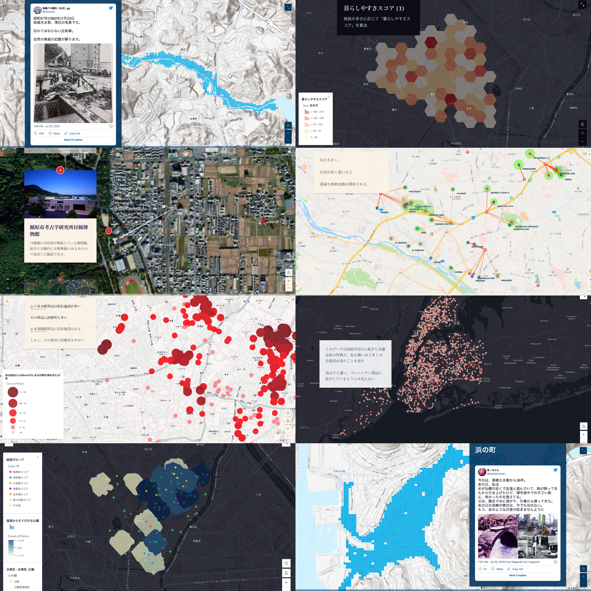

# AIと情報可視化・OSINT教育

> 公開情報を検証し，根拠ある説明として社会へ届ける情報メディア教育モデル

本レポートが示すのは，公開情報を集める技術そのものではなく，公開情報を検証可能な知識へと組み替え，社会に伝える力を育てる教育モデルである。東京大学前期課程「情報メディア基礎論」では，情報を“ストック”し，データビジュアライゼーションやデジタルアーカイブによって“フロー”化するメディア実践を通じて，情報・メディア・社会の関係を学ぶ[1]。授業では，学生が自ら問いを設定し，データを収集・整理したうえで，ArcGISやRe:Earthを用いて2D／3D地図上に可視化し，成果物をウェブ公開する。2022年度のArcGIS Onlineを用いた学生作品，2023年度のProject PLATEAUとRe:Earthを用いた3D都市モデルの可視化は，いずれもデータを単なる素材ではなく，根拠をもつ社会的な説明へ変換する実践として位置づけられる[2,3]。

*図1. GIS・データ可視化を用いた学生作品例*

本実践の特徴は，この一連のプロセスに生成AIとの対話を組み込む点にある。学生は，テーマ設定，データ探索，仮説形成，地図化，文章化，公開時の説明文作成に至る各段階でAIを活用する。AIは，単に答えを出す存在ではなく，観察結果を言語化し，複数の解釈可能性を比較し，データの不足や推論の飛躍を指摘する「対話的な編集者」として機能する。これは，AIを安全かつ批判的に使う能力を，単なる操作技能ではなく，倫理・判断・創造を含む総合的なコンピテンシーとして捉える近年のAI教育論とも合致する。UNESCOのAIコンピテンシー枠組みも，学生をAIの受動的利用者ではなく，責任ある利用者・共同設計者として育成する必要性を示している[4]。

近年は，この方法をOSINT教育にも展開している。ここで重視するのは，AIS，衛星画像，公開報道，SNS上の専門的知見といった多様な公開情報を，ばらばらの断片として扱うのではなく，出所，時刻，空間的位置，解釈の確度を照合しながら，一つの検証可能な説明へ組み立てることである[5]。ホルムズ海峡周辺の船舶動向，戦災・災害，山林火災などを扱う実践では，参加者は「何が起きたか」を急いで断定するのではなく，どこまでが観察で，どこからが推論なのかを区別する態度を学ぶ。noteマガジンに記録される実践群やBellingcatのオンライン調査ツールキットは，公開情報を用いた調査報道や市民調査の方法論を教育へ接続する参照点となる[6,7,8]。

また，本実践はメディア・情報リテラシー教育の拡張としても位置づけられる。UNESCOは，偽情報，ヘイトスピーチ，メディア不信，AIを含むデジタル技術の進展に対応するため，メディア・情報リテラシーを21世紀の基礎的能力として整理している[9]。OSINT教育において重要なのは，データを「見つける」ことだけではない。情報源の性質を見極め，複数のデータを照合し，確度の異なる推論を区別し，社会に伝える際の表現責任を自覚することである。これは，データ可視化を単なる表現技術ではなく，社会の中で意味を生み出す批判的実践として捉えるデータ・ビジュアライゼーション研究とも重なる[10,11]。

本実践は，東京大学の授業，あるいはマスメディアとの学術指導・共同研究を横断する「教育×AI×OSINT」の試みである。読売新聞への学術指導では，能登半島地震の発生後，記者が撮影した写真の手がかりやGPS情報をもとにArcGIS StoryMapsで被災状況を地図化し，当日夜から公開・更新する実践へつながった[12]。日本テレビとの共同研究では，衛星画像等を用いた調査報道の事例も公開されている[13,14]。学生や記者は，AIを用いながら，データを集め，疑い，照合し，仮説を組み立て，社会に向けて説明するプロセスを学ぶ。重要なのは，AIに判断を委ねることではなく，AIとの対話を通じて，人間の観察力，批判的思考，表現力を拡張することである。公開情報を扱う教育は，結論の速さよりも，根拠の透明性と説明責任を学ぶ場として設計される必要がある。

## 参考文献・関連資料

1. 東京大学. n.d. 情報メディア基礎論. 東京大学授業カタログ. Retrieved May 27, 2026 from https://catalog.he.u-tokyo.ac.jp/detail?code=30259
2. Hidenori Watanave. 2022. ArcGIS Onlineを用いたオープンデータの可視化・学生作品（2022年度）. Hidenori Watanave Lab. Retrieved May 27, 2026 from https://labo.wtnv.jp/2022/05/arcgis-online2022.html
3. 国土交通省 Project PLATEAU. 2023. 大学生が挑戦。GISを使って過去の災害データを可視化・継承する. PLATEAU Journal. Retrieved May 27, 2026 from https://www.mlit.go.jp/plateau/journal/j033/
4. UNESCO. 2024. AI Competency Framework for Students. UNESCO. Retrieved May 27, 2026 from https://www.unesco.org/en/articles/ai-competency-framework-students
5. wtnv-lab. 2026. gee-sentinel2-osi. GitHub repository. Retrieved May 27, 2026 from https://github.com/wtnv-lab/gee-sentinel2-osi
6. Bellingcat. 2021. First Steps to Getting Started in Open Source Research. Bellingcat. Retrieved May 27, 2026 from https://www.bellingcat.com/resources/2021/11/09/first-steps-to-getting-started-in-open-source-research/
7. Bellingcat. n.d. Online Open Source Investigation Toolkit. Bellingcat. Retrieved May 27, 2026 from https://bellingcat.gitbook.io/toolkit
8. 渡邉英徳. n.d. 戦災・災害のOSINT. note. Retrieved May 27, 2026 from https://note.com/hwtnv/m/m04416eca695b
9. UNESCO. n.d. Media and Information Literacy Curriculum for Teachers and Learners. UNESCO. Retrieved May 27, 2026 from https://www.unesco.org/mil4teachers/en/curriculum
10. Alberto Cairo. 2016. The Truthful Art: Data, Charts, and Maps for Communication. New Riders. Retrieved May 27, 2026 from https://www.peachpit.com/store/truthful-art-data-charts-and-maps-for-communication-9780321934079
11. Jonathan Gray, Liliana Bounegru, Stefania Milan, and Paolo Ciuccarelli. 2016. Ways of Seeing Data: Toward a Critical Literacy for Data Visualizations as Research Objects and Research Devices. In Innovative Methods in Media and Communication Research. Retrieved May 27, 2026 from https://www.researchgate.net/publication/312284929_Ways_of_Seeing_Data_Toward_a_Critical_Literacy_for_Data_Visualizations_as_Research_Objects_and_Research_Devices
12. よみうりノート. 2024. 記者たちで作る能登地震被災状況マップ（記者の現場＃７）. note. Retrieved May 30, 2026 from https://note.com/yomi_tokyo_saiyo/n/n8cf9838e1a3a
13. 日テレNEWS. 2026. 【独自分析】カーグ島で大規模石油流出か…広い海域に拡散 イランの石油輸出拠点. YouTube. Retrieved May 28, 2026 from https://www.youtube.com/watch?v=ulJRQ8TvkW4
14. 東京大学大学院情報学環・学際情報学府. 2025. 東京大学情報学環渡邉英徳研究室と日本テレビホールディングス、「先端技術を活用した報道手法のアップデート」を目的に共同研究を開始. Retrieved May 27, 2026 from https://www.iii.u-tokyo.ac.jp/news/2025020321925

## メタデータ

| 項目 | 内容 |
| --- | --- |
| ID | `01-information-visualization-osint` |
| プロジェクト | AIとクリエイティブと教育 |
| 日付 | 2026-05-27 |
| バージョン | 1.0.0 |
| 種別 | report |
| 概要 | GIS・データ可視化・OSINTを通じて、公開情報を検証し社会へ伝える情報メディア教育モデル。 |
| 著者 | 渡邉英徳 |
| 想定読者 | 情報・メディア・探究学習を担当する高校・大学教員 データ可視化、GIS、デジタルアーカイブを授業に取り入れたい教育者 OSINTや調査報道の基礎を教育・研修化したい報道関係者 公開情報の検証と社会的説明を扱う教材・サービス企画者 |
| 主要示唆 | GIS、データ可視化、OSINTは、公開情報を検証可能な形で読み解く情報メディア教育の中核になる。 AIは結論を代行するのではなく、観察、仮説比較、説明の点検を支援する対話的編集者として使う。 読売新聞への学術指導や日本テレビとの共同研究事例は、教育・報道・社会課題を接続する実践モデルになる。 |
| 活用場面 | 高校・大学のGIS、データ可視化、OSINT授業 報道機関や自治体と連携した公開情報検証ワークショップ 災害、地域課題、都市分析を扱う探究学習 情報可視化教材や調査支援サービスの企画 |
| 学習活動案 | 地域の公開データを地図化し、分布や偏りについてAIと対話しながら仮説を作る。 ニュースやSNS投稿の位置情報・時系列・出典を検証し、確実に言えることと推測を分ける。 地図、グラフ、テキストを組み合わせ、第三者に説明可能な調査レポートを作成する。 |
| 実装アイデア | GIS作品例を使った導入ワークショップを設計し、地図表現の読み解きから始める。 OSINT検証ラボとして、公開情報の収集、照合、説明文作成、AIによる推論チェックを行う。 報道機関や自治体と連携し、地域課題を扱うデータストーリーテリング課題を実施する。 |
| concept_alignment | {"schema":"aice.concept_alignment.v1","primary_stage_ids":["question_framing","source_evaluation","human_verification","public_communication"],"supporting_stage_ids":["prototyping"],"literacy_ids":["ai_competency_citizenship","design_editing_critical_thinking","publicness_social_responsibility"],"ai_role_ids":["observation_verbalization","hypothesis_comparison","inference_check","editorial_support"],"human_responsibility_ids":["source_verification","observation_inference_separation","evidence_transparency","explanatory_accountability"],"domain_tags":["osint","gis","data_visualization","public_information","media_literacy"]} |
| 関連レポート | 00-overview 03-digital-citizenship 05-digital-archive-ai |
| 引用メモ | GIS・情報可視化・OSINTを組み合わせた情報メディア教育モデル。 |
| テーマ | 生成AI 情報可視化 OSINT 探究学習 |
| キーワード | 情報可視化 OSINT メディアリテラシー 探究学習 |
| ライセンス | CC BY 4.0 |
