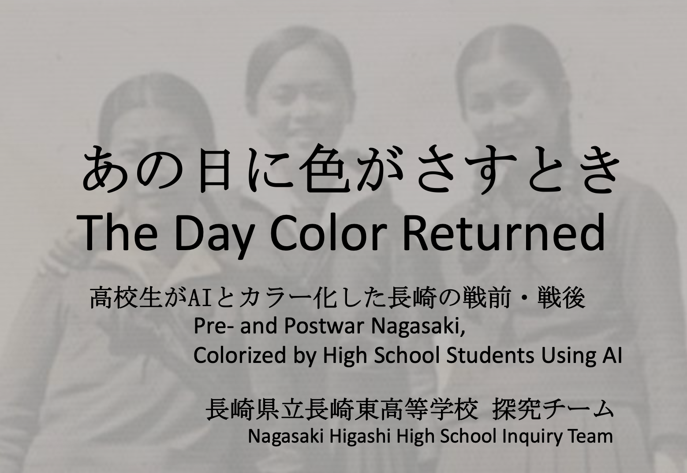
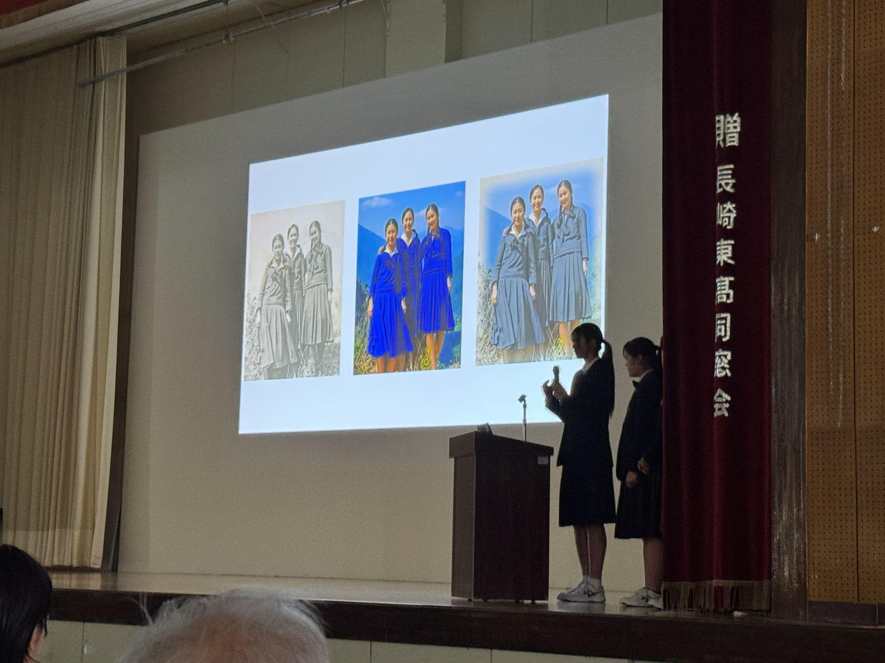

# AIによるモノクロ写真カラー化を活かした高校生の平和教育実践

> AIカラー化を入口に，記憶を読み解き社会へ継承する平和教育モデル

*図1. 写真集「あの日に色がさすとき」表紙*

長崎県立長崎東高校の生徒による「あの日に色がさすとき」は，AIによるモノクロ写真のカラー化を起点に，戦前・戦後の長崎の記憶を次世代へ継承する探究型学習の実践である[1,2]。生徒たちは，戦前・戦後の長崎を写した白黒写真20点を題材に，AIで自動カラー化したうえで，被爆者や専門家への聞き取りを通じて色味を補正し，写真集としてまとめた[3,4]。題材には，長崎大学核兵器廃絶研究センター（RECNA）の「被爆前の日常アーカイブ」に関わる写真が用いられ，完成した写真集は長崎市や図書館，平和関連施設，国際機関などへ寄贈・共有された[1]。

この実践の特徴は，AIを単なる画像処理ツールとして用いるのではなく，「本物の色とは何か」を問う探究の入口として位置づけている点にある。写真集には，白黒写真とカラー化写真だけでなく，専門家による講義，被爆者との対話，AIによるカラー化手法，撮影地へアクセスできるQRコードなども収録されている。したがって本実践は，画像の復元にとどまらず，写真一枚一枚に込められた記憶や証言を読み解き，歴史理解と平和構築へ接続する総合的な学習成果といえる。

教育的意義は三点に整理できる。第一に，カラー化は，今を生きる生徒たちと戦前・戦後の長崎との「再接続」を生み出すことである。本来，現在と過去は断絶しているわけではなく，私たちの日常は，かつて同じ場所で営まれていた生活の延長線上にある。しかし白黒写真として残された過去は，日常生活のなかでは遠い歴史として受け取られやすい。そこに色が加わることで，写っている人々の服装，街並み，表情，生活の気配が，作り手である生徒にとっても，受け手である鑑賞者にとっても，現前のものとして立ち上がる。参加した生徒からも，白黒写真では陰影しか分からなかったが，カラー化によって鮮やかな着物を着ていたことが分かった，という気づきが示されている[4]。カラー化は，過去を現在に似せる操作ではなく，もともと連続していた時間と場所を，あらためて感じ取れるようにする「再接続」のメディアなのである。

第二に，AIの出力を批判的に検証する姿勢を育てている点である。AIカラー化は，過去の色を「正解」として復元するものではない。大量の画像データから推定された仮説であり，誤りや過剰な鮮やかさも含みうる。そこで生徒たちは，当時の幟や服装，街並みの色について専門家に確認し，色が実体とかけ離れていないかを一つひとつ検討した。このプロセスにより，AIを便利な道具として使うだけでなく，その出力を資料・証言・地域の知見と照合しながら判断する，AIリテラシーと歴史資料批判の双方が育まれている。

第三に，成果物を社会に届ける実践になっている点である。写真集は非売品として公共的な場所へ配布され，クラウドファンディングによって活動の持続化も図られた。ここで重要なのは，生徒の学習成果が教室内の発表で終わらず，地域社会，平和教育施設，海外の関係機関へと開かれていることである。探究学習が「調べる」段階にとどまらず，社会へ伝え，対話を生み出すメディア実践へと展開している。

*図2. 長崎東高校の生徒による発表風景*

この実践は，渡邉・庭田による「記憶の解凍」の理論とも接続する。同論文では，デジタルアーカイブに“ストック”された白黒写真をAIでカラー化し，そこから社会的な“フロー”を生み出すことで，過去と現在の心理的距離を縮め，対話を誘発すると論じられている[5]。本実践に即して言えば，カラー化は失われた色を機械的に補う作業ではなく，写真のなかの過去と，いま写真を見ている人びとの生活感覚を再接続する行為である。色をめぐる考証や証言の聞き取りを通じて，生徒たちは「昔の長崎」を外部の対象として眺めるのではなく，自分たちの住む場所や社会の延長として捉え直していく。

「あの日に色がさすとき」は，AI時代の平和教育の重要なモデルである。生徒はAIを使って過去を「再現」するだけでなく，その出力を疑い，証言と照らし合わせ，社会に向けて表現する。ここでは，AIリテラシー，歴史理解，メディア表現，平和教育が一体化している。被爆者から直接話を聞く機会が少なくなる時代において，重要なのは記憶を保存するだけではなく，若い世代が根拠を確かめながら自分の言葉で継承することである。本プロジェクトは，AIをそのための入口として使う平和教育の可能性を具体的に示している。

## 参考文献・関連資料

1. 長崎県立長崎東中学校・高等学校. 2026. あの日に色がさすとき: 高校生がAIとカラー化した長崎の戦前・戦後. Retrieved May 27, 2026 from https://www.news.ed.jp/higashi-h/img/file13.pdf
2. 長崎県立長崎東中学校・高等学校. n.d. WWL・DX: あの日に色がさすとき. Retrieved May 27, 2026 from https://www.news.ed.jp/higashi-h/wwldx.html
3. NCC長崎文化放送. 2026. AIでよみがえる戦前の長崎 高校生が写真集制作. Retrieved May 27, 2026 from https://www.ncctv.co.jp/news/article/16463000
4. 日テレNEWS NNN. 2025. 次世代への継承「原爆投下前の長崎の白黒写真をカラー化」高校生が最新技術を活用し挑戦《長崎》. Retrieved May 27, 2026 from https://news.ntv.co.jp/category/society/ni48845778ff4347bbaedd512c7cdeeece
5. Hidenori Watanave and Anju Niwata. 2019. 「記憶の解凍」：カラー化写真をもとにした“フロー”の生成と記憶の継承. デジタルアーカイブ学会誌 3, 3 (2019), 317–323. https://doi.org/10.24506/jsda.3.3_317

## メタデータ

| 項目 | 内容 |
| --- | --- |
| ID | `02-photo-colorization-peace-education` |
| プロジェクト | AIとクリエイティブと教育 |
| 日付 | 2026-05-27 |
| バージョン | 1.0.0 |
| 種別 | report |
| 概要 | AIカラー化を、写真資料・証言・地域の記憶をつなぐ平和教育と記憶継承の探究へ展開。 |
| 著者 | 森吉蓉子 渡邉英徳 |
| 想定読者 | 平和教育・歴史教育・地域学習を担当する中学・高校教員 写真資料や証言を活用する博物館・資料館・地域アーカイブ担当者 AIカラー化を探究学習や記憶継承に活かしたい教育実践者 生徒の成果発信や社会連携型プロジェクトを支援する担当者 |
| 主要示唆 | AIカラー化は過去を正確に復元する処理ではなく、資料批判と対話を促す探究の入口になる。 高校生が写真、証言、地域の記憶を照合することで、平和教育を受け身の学習から社会発信へ広げられる。 AIリテラシーと歴史資料の扱いを結び、記憶継承を若い世代の表現活動として設計できる。 |
| 活用場面 | 中学・高校の平和教育、歴史教育、地域学習 博物館・資料館と学校が連携する写真資料活用授業 AIカラー化をめぐる資料批判と倫理の教材化 生徒による展示、発表、写真集制作プロジェクト |
| 学習活動案 | 白黒写真を観察し、AIカラー化前後で印象や解釈がどう変わるかを記録する。 証言や専門資料を参照し、AIが生成した色の妥当性と限界を検討する。 写真に添えるキャプションや発表原稿を作り、記憶継承の表現として公開する。 |
| 実装アイデア | 地域資料館と連携し、写真選定、カラー化、検証、展示までを一連の探究にする。 発表風景や制作物の図版を含め、学習成果を外部に説明できるポートフォリオにまとめる。 AI利用の透明性、資料出典、証言者への配慮を評価項目に入れたルーブリックを作る。 |
| concept_alignment | {"schema":"aice.concept_alignment.v1","primary_stage_ids":["source_evaluation","human_verification","public_communication"],"supporting_stage_ids":["question_framing","prototyping"],"literacy_ids":["ai_competency_citizenship","design_editing_critical_thinking","publicness_social_responsibility"],"ai_role_ids":["colorization_probe","interpretation_prompt","dialogue_support"],"human_responsibility_ids":["testimony_crosscheck","uncertainty_disclosure","responsible_representation","memory_ethics"],"domain_tags":["photo_colorization","peace_education","memory_inheritance","historical_photos"]} |
| 関連レポート | 00-overview 03-digital-citizenship 05-digital-archive-ai |
| 引用メモ | AIカラー化を平和教育、資料批判、社会発信に結びつけた高校生の実践事例。 |
| テーマ | 生成AI 写真カラー化 平和教育 歴史学習 |
| キーワード | 写真カラー化 平和教育 高校教育 歴史資料 |
| ライセンス | CC BY 4.0 |
