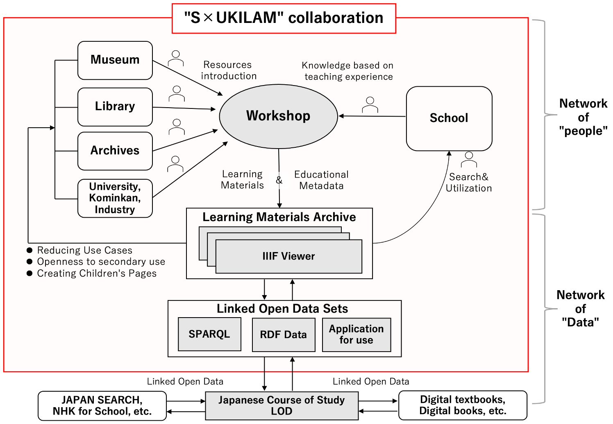

# デジタルアーカイブとAIを活かした教育実践

> 資料を保存から探究へひらき，出典と文脈を確かめる学び

デジタルアーカイブとAIを組み合わせた教育実践は，資料を単に保存・閲覧する段階から，学習者が問いを立て，資料を読み解き，他者へ伝える探究的な学びへと発展させる可能性を持つ。デジタルアーカイブは，写真，文書，地図，映像，文化財などを体系的に蓄積する基盤である。しかし，資料が「そこにある」だけでは，学習者の関心や授業実践には直結しにくい。重要なのは，ストックされた資料を，学習者の問い，対話，表現を通じてフロー化する設計である。

*図1. S×UKILAMワークショップのコンセプト：多様な資料から教材を共創する*

その代表例が，ジャパンサーチを活用したキュレーション型授業である。大井・渡邉らは，デジタルアーカイブの教育活用には，教科書やカリキュラムとの接続，児童生徒自身の「問い」に基づく実践の蓄積が必要であるとし，小中高でのキュレーション授業を提案している[1]。そこでは，学習者が一つの資料から問いを立て，関連資料を探索・選択し，複数の資料を関係づけながら意味を構成する。これは，既成の答えを受け取る学びではなく，資料を通じて多面的・多角的な視座を獲得する学びである。

さらに，探究学習における「問い」と「資料」の接続を支援するモデルとして，ジャパンサーチの検索機能や協働キュレーション機能を用いた実践も展開されている。この研究では，生徒自身の問いを起点とし，資料を収集し，考察する力が向上したことが示唆されている[1]。すなわち，デジタルアーカイブは，教師が用意した資料を提示するためだけの装置ではなく，学習者が自ら資料と出会い，問いを構造化し，根拠にもとづいて考えるための知的環境となる。

AIは，この学習過程をさらに拡張する。たとえば，白黒写真のAIカラー化を活用した歴史教材では，児童の家族・親族の写真をAIでカラー化し，家庭内での聞き取りや教室での発表につなげる実践が行われた。白黒写真はしばしば「遠い過去」という印象を与えるが，色彩が加わることで，写真に写る人物の表情や生活感が現在に近づき，世代間対話を促す。ここでAIは，正解を与える装置ではなく，資料を読み直し，過去と現在，学習者と家族，記録と記憶を再接続する媒介として機能している。

また，S×UKILAM連携は，学校，大学，公民館，産業界，図書館，文書館，博物館を結ぶ「人」と「データ」のネットワークとして重要である。全国規模のワークショップでは，教員と資料公開機関の関係者が協働して教材化を行い，教育メタデータを付与した教材をIIIFにより公開している[2,3]。これにより，資料は専門機関の内部に閉じたものではなく，学年，教科，単元，地域，時代などの教育文脈から再利用可能な教材となる。

*図2. S×UKILAM連携における「人」と「データ」のネットワーク*

国際的にも，AIとデジタル資料を活用する教育には，批判的・倫理的な視点が求められている。UNESCOのAIコンピテンシー枠組みは，学習者をAIの受動的利用者ではなく，責任ある利用者・共同設計者として育成する必要性を示している[4]。また，UNESCOのメディア・情報リテラシー教育は，インターネット，図書館，デジタルアーカイブなどが一体化する情報環境を前提に，情報を批判的に読み解き，責任をもって活用する力を重視している[5]。

以上を踏まえると，デジタルアーカイブとAIを活かした教育実践の核心は，資料のデジタル化そのものではない。資料を起点に問いを生み，AIを対話的な補助者として使い，過去と現在，個人と社会，地域と世界を結び直す学習デザインにある。今後の教育では，AIによる生成・補助の利便性と，デジタルアーカイブがもつ一次資料性・公共性を組み合わせ，学習者が出典と文脈を確かめながら考え，表現し，社会へ伝える力を育てることが重要になる。

## 参考文献・関連資料

1. Masao Oi and Hidenori Watanave. 2020. ジャパンサーチを活用した小中高でのキュレーション授業デザイン：デジタルアーカイブの教育活用意義と可能性. デジタルアーカイブ学会誌 4, 4 (2020), 352–359. https://doi.org/10.24506/jsda.4.4_352
2. ADEAC. n.d. S×UKILAM：Primary Source Sets／スキラム連携：多様な資料を活用した教材アーカイブ. Retrieved May 27, 2026 from https://adeac.jp/adeac-lab/top/sxukilam/index.html
3. Masao Oi and Hidenori Watanave. 2022. S×UKILAM連携：多様な資料を学校教育で活用するための「人」と「データ」のネットワーク構築. デジタルアーカイブ学会誌 6, s3 (2022), s214–s217. https://doi.org/10.24506/jsda.6.s3_s214
4. UNESCO. 2024. AI Competency Framework for Students. UNESCO. Retrieved May 27, 2026 from https://www.unesco.org/en/articles/ai-competency-framework-students
5. UNESCO. n.d. Media and Information Literacy Curriculum for Teachers and Learners. UNESCO. Retrieved May 27, 2026 from https://www.unesco.org/mil4teachers/en/curriculum

## メタデータ

| 項目 | 内容 |
| --- | --- |
| ID | `05-digital-archive-ai` |
| プロジェクト | AIとクリエイティブと教育 |
| 日付 | 2026-05-27 |
| バージョン | 1.0.0 |
| 種別 | report |
| 概要 | デジタルアーカイブを資料保存の基盤にとどめず、学習者が問いを立て、資料を選び、AIの支援も用いて意味を構成し社会へ伝える探究環境として捉える。ジャパンサーチ、AIカラー化教材、S×UKILAM連携を通じて、一次資料性と生成AIの利便性を組み合わせた教育実践の可能性を整理する。 |
| 著者 | 大井将生 |
| 想定読者 | 学校教育で一次資料や地域資料を活用したい教員 デジタルアーカイブの教育利用を進める図書館・博物館・自治体担当者 探究学習、キュレーション授業、教材アーカイブを設計する教育者 AIと資料検索・要約・再編集を組み合わせた学習サービス企画者 |
| 主要示唆 | デジタルアーカイブは保存基盤にとどまらず、学習者が問いを立て資料を再編集する探究環境になる。 AIは検索、要約、比較、表現を支援するが、一次資料性と出典確認を学習活動に組み込む必要がある。 資料活用、AIカラー化、S×UKILAM連携は、学校と文化資源を結ぶ教育実践の基盤になる。 |
| 活用場面 | 一次資料や地域資料を活用した探究学習 図書館・博物館・自治体の教育連携プログラム デジタルアーカイブを使う教材・検索支援サービスの企画 AIによる資料要約、比較、再編集を扱う授業 |
| 学習活動案 | ジャパンサーチ等で資料を探し、出典、作成時期、文脈を確認して問いを立てる。 AIに資料の要約や比較をさせ、その妥当性を原資料に戻って検証する。 複数資料を組み合わせ、展示案、教材、地域ストーリーとして再構成する。 |
| 実装アイデア | 学校と図書館・博物館が連携し、地域資料を使う探究単元を設計する。 AI検索・要約機能に、出典確認と一次資料へのリンクを必ず表示する設計にする。 学習成果をデジタル展示や教材アーカイブとして蓄積し、次年度の学習資源にする。 |
| 概念図との対応 | 資料の吟味: デジタルアーカイブの一次資料性、出典、文脈を確認する。 プロトタイピング: AIの検索、要約、比較を使い、教材や展示案を試作する。 社会へ発信: 資料を教材、展示、地域ストーリーとして再編集する。 |
| 関連レポート | 00-overview 01-information-visualization-osint 02-photo-colorization-peace-education |
| 引用メモ | デジタルアーカイブと生成AIを組み合わせ、一次資料を用いた探究学習を設計するレポート。 |
| テーマ | 生成AI デジタルアーカイブ 教育実践 資料活用 |
| キーワード | デジタルアーカイブ 資料活用 探究学習 AI教育 |
| ライセンス | CC BY 4.0 |
