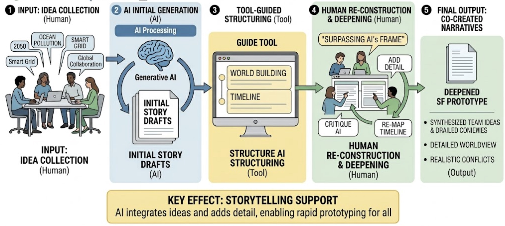

# 生成AIを用いたSFプロトタイピング

> AIが仮設した未来を，人間が批判し再構成する創造ワークショップ

*図1. 生成AIを用いたSFプロトタイピング・ワークショップのイメージ*

　SFプロトタイピングは，サイエンス・フィクションの発想を用いて，まだ存在しない技術・制度・生活様式を物語として描き，他者と未来像を議論する方法である。Brian David Johnsonは，SFを単なる空想ではなく，未来の技術や製品の含意を検討するための実践的な道具として位置づけた[1]。日本でも，企業や行政，大学において，未来洞察，事業構想，組織変革の手法として導入が進んでいる[2]。

　従来のSFプロトタイピングでは，小説家，SF作家，デザイナー，アーティストなど，物語化に長けた専門家の関与が重要だった。未来社会を単なるアイデアの列挙ではなく，人物，葛藤，制度，生活環境を含む「世界観」として描く必要があるためである。特に、他の未来洞察や思考法との大きな違いの一つとして、ストーリーテリングが挙げられる。未来の状況をプロット（物語）として具体的に肉付けし、そこでの生活や課題をリアルに想像することこそが本手法の核心だからである。しかし、このようなストーリー構築を非熟練者のみで行うことは極めて難しく、何らかの形で専門家の補助が不可欠であった。

　しかし，専門家を常に招聘することは難しく，短時間の研修や企業内ワークショップ，学生向け演習では，参加者全員のアイディアから１つのストーリーを構築するのに時間がかかる，発言力のある参加者の意見に偏る，ワークショップ進行の判断基準が曖昧になる，といった課題が生じやすい。

　この課題に対して，生成AIは有効な補助線となる。東京大学大学院情報学環・学際情報学府の楊欽・渡邉英徳による研究では，小説家などの専門家が不在でも実施可能なSFプロトタイピングワークショップ手法が提案されている[3]。手法は，キーワードによるアイデア収集，AIによる初期ストーリー生成，ガイドフレームワークとなりうるツール支援，AI出力への評価・批判プロセスから構成される。専門家の代替として、AIの利用だけでなく、ワークショップの進行や参加者の主体性を導くツールが非常に重要である。生成AIによる物語生成やデザイン発想支援に関する研究も，AIが参加者の発想を広げる一方で，人間による評価と再構成が不可欠であることを示している[4,5]。

*図2. 生成AI支援SFプロトタイピングのプロセス*

　実践の結果、本手法のメインの効果として、AIが全員のアイデアを一つのストーリーへと自然にまとめ上げ、物語の細部を具体的に詳細化（肉付け）できるという、ストーリーテリングの強力な補助効果が確認された。さらに、この手法の他の効用として、短時間でSFプロトタイピングの本格的な体験が可能になることや、発言力に左右されず参加者全員の視点が公平に物語へ反映されること、架空世界への没入が促進されることなども挙げられる。ここで最も重要なのは、単にAIを利用して効率化を図るだけでなく、出力された物語を起点に参加者が主体的に思考し、「AIを超える」ことを強く意識して再構成を目指す点である。

　この方法は，教育だけでなく，産学協創や組織改革にも応用可能である。東京大学の企業協創プログラムでは，ダイキン工業や電通との連携のもと，生成AIを用いたSFプロトタイピング型ワークショップが実施されている[6]。たとえばダイキンとのワークショップでは「2050年の空調」，電通とのワークショップでは「2050年の東京湾」といったテーマが設定され，参加者は遠い未来の生活環境，都市，気候，産業，メディア体験を物語として構想した[7]。ここで重要なのは，空調や湾岸地域を単なる技術・施設として扱うのではなく，人々の暮らし，身体感覚，環境変化，社会制度，都市の使われ方を含む未来の「世界観」として描く点である。生成AIは，参加者の断片的なキーワードや問題意識を短時間で複数のシナリオに展開し，それをもとに参加者が批判・修正・再構成するためのたたき台を提供する。これにより，専門分野や職位の異なる参加者が，共通の未来像を媒介に議論しやすくなる。

　同様に，若手職員向けの業務改革ワークショップにも適している。業務改革は，しばしば既存業務の効率化に閉じがちである。しかしSFプロトタイピングを用いれば，「10年後の大学事務」「AIエージェントと協働する研究支援」「学生が迷わない窓口体験」など，未来の利用者像から逆算して現在の制度や業務を再設計できる。ダイキンや電通との実践が示すように，未来のテーマを大胆に設定することで，参加者は現在の制約から一度離れ，そのうえで現在に戻ってくるバックキャスティング型の思考を行える。生成AIは，その往復運動を支える対話相手として機能する。

　生成AIを用いたSFプロトタイピングの意義は，AIに未来を予測させることではない。むしろ，人間が未来を語るための足場をAIに仮設させ，その足場を批判し，組み替え，よりよい未来像を共創する点にある。未来の物語は，AIが出した答えではなく，参加者が価値観，リスク，社会的含意を読み解きながら引き受ける仮説である。AI時代の創造的ワークショップは，効率化のための道具利用にとどまらず，人間の批判力や、物語のディテール（細部）をリアリティを持って構想する能力、そして合意形成力を拡張する教育・組織開発の方法として位置づけられる。

## 参考文献・関連資料

1. Brian David Johnson. 2011. Science Fiction Prototyping: Designing the Future with Science Fiction. Morgan & Claypool. https://doi.org/10.2200/S00336ED1V01Y201102CSL003
2. 宮本道人, 難波優輝, and 大澤博隆. 2021. SFプロトタイピング：SFからイノベーションを生み出す新戦略. 早川書房.
3. Qin Yang and Hidenori Watanave. 2024. 小説家不要のSFプロトタイピングワークショップ手法の提案：生成AIとの共同作業によるストーリーテリング支援. In 2024年度人工知能学会全国大会（第38回）. https://doi.org/10.11517/pjsai.JSAI2024.0_2A4GS1004
4. Haoran Chu and Sixiao Liu. 2024. Can AI tell good stories? Narrative transportation and persuasion with ChatGPT. Journal of Communication 74, 5 (October 2024), 347–358. https://doi.org/10.1093/joc/jqae029
5. Jakob Tholander and Martin Jonsson. 2023. Design Ideation with AI. In Proceedings of the 2023 ACM Designing Interactive Systems Conference (DIS '23). ACM, 1934–1946. https://doi.org/10.1145/3563657.3596014
6. 東京大学. n.d. グローバルインターンシッププログラム・企業協創プログラム. Retrieved May 27, 2026 from https://www.u-tokyo.ac.jp/ja/students/special-activities/ugip.html
7. ダイキン工業. 2018. 東京大学とダイキン工業「空気の価値化」を目指す産学協創協定を締結. Retrieved May 27, 2026 from https://www.daikin.co.jp/press/2018/20181217

## メタデータ

| 項目 | 内容 |
| --- | --- |
| ID | `06-sf-prototyping` |
| プロジェクト | AIとクリエイティブと教育 |
| 日付 | 2026-05-27 |
| バージョン | 1.0.0 |
| 種別 | report |
| 概要 | 生成AIで未来シナリオを素早く仮設し、人間が批判・修正するSFプロトタイピングの教育活用。 |
| 著者 | 楊欽 渡邉英徳 |
| 想定読者 | 未来構想・探究学習・創造性教育を担当する大学・高校教員 産学協創、企業研修、ワークショップを設計するファシリテーター 新規事業開発やビジョン策定にSFプロトタイピングを使いたい企画担当者 生成AIを用いた物語生成・合意形成・アイデア創出に関心を持つ実践者 |
| 主要示唆 | 生成AIは未来社会の物語や世界観を短時間で立ち上げ、SFプロトタイピングの参加ハードルを下げる。 重要なのはAIが出した未来像を批判、修正、再構成し、望ましい未来と避けたい未来を議論することである。 SFプロトタイピングは教育、産学協創、事業開発における想像力と合意形成を支援する。 |
| 活用場面 | 高校・大学の未来構想、探究学習、創造性教育 企業研修、産学協創、新規事業開発ワークショップ 地域や組織のビジョン策定 生成AIを用いた物語生成・アイデア創出教材 |
| 学習活動案 | AIに未来シナリオを複数生成させ、前提、価値観、リスクを読み解く。 参加者が未来像を修正し、望ましい技術利用や社会制度を提案する。 SFプロトタイプを短編、新聞記事、サービス広告、政策提案などの形式で表現する。 |
| 実装アイデア | 90分から半日のSFプロトタイピングワークショップを設計し、AI生成と人間の批評を交互に行う。 新規事業や研究テーマ検討で、未来シナリオ、ステークホルダー、倫理的論点を可視化する。 成果物をハッカソンやPBLの課題設定に接続し、プロトタイプ制作へ展開する。 |
| concept_alignment | {"schema":"aice.concept_alignment.v1","primary_stage_ids":["question_framing","prototyping","human_verification"],"supporting_stage_ids":["public_communication"],"literacy_ids":["ai_competency_citizenship","design_editing_critical_thinking","publicness_social_responsibility"],"ai_role_ids":["scenario_generation","worldbuilding","alternative_generation","ideation_support"],"human_responsibility_ids":["future_assumption_critique","value_judgment","scenario_revision","consensus_building"],"domain_tags":["sf_prototyping","future_scenarios","workshop","backcasting"]} |
| 関連レポート | 00-overview 03-digital-citizenship 04-student-hackathon |
| 引用メモ | 生成AIを用いて未来構想を民主化し、教育・産学協創・事業開発に応用するSFプロトタイピングのレポート。 |
| テーマ | 生成AI SFプロトタイピング 未来構想 創造性教育 |
| キーワード | SFプロトタイピング 未来洞察 創造性 ワークショップ |
| ライセンス | CC BY 4.0 |
