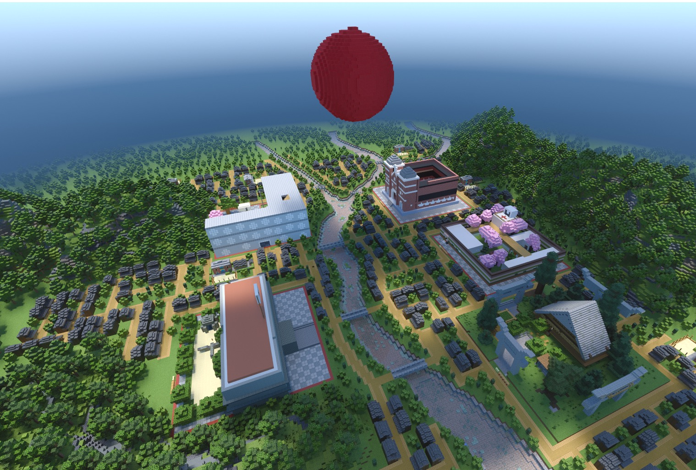
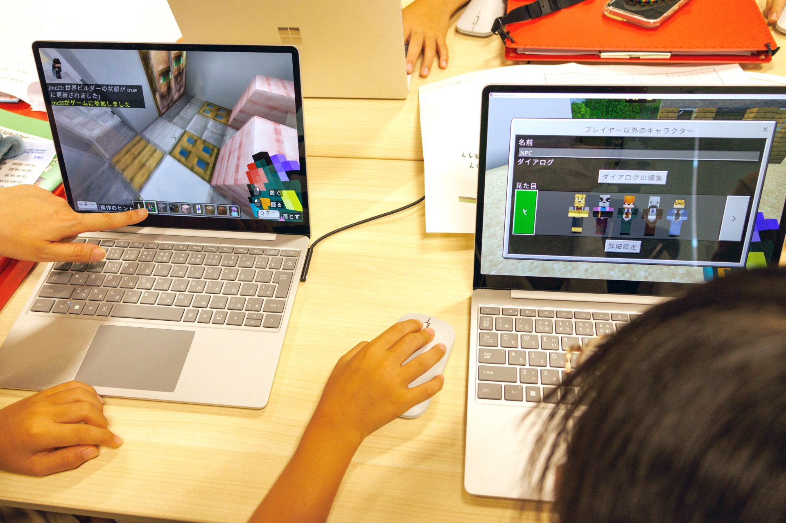

# AIとMinecraft教育：遊びの空間を，記憶・創造・AIリテラシーの学びへ

> 仮想空間で記憶を再構成し，創造とAIリテラシーを育てる学び

*図1. 長崎のMinecraftワールド*

Minecraftは単なるゲームではなく，子どもや若者が世界を構築し，過去を再現し，未来を構想するための学習環境として注目されている。ブロックを積み上げる直感的な操作は，専門的なプログラミング経験の有無にかかわらず参加者を創作に導く。そこにAIが加わることで，歴史資料の読み解き，画像のカラー化，仮想空間内のエージェント操作，生成AIを用いたストーリーテリングなど，多層的な学びが可能になる[1,2]。

国内の代表的な実践が，戦災・災害の記憶継承を目的としたPeacecraft系のワークショップである。広島，長崎，東京，長岡などで展開された取り組みでは，戦前の街並みや失われた日常を，子どもたちがMinecraft上で再構築する[3]。事前学習では，白黒写真をAIでカラー化した資料や証言を用い，当時の人びとの暮らしを具体的に想像する。カラー化は過去を単に「見やすくする」技術ではない。いまを生きる参加者と，写真のなかの過去の生活とを再接続し，歴史を自分ごととして考える契機となる。

この実践の重要性は，知識伝達型の平和教育から，制作と対話を通じた参加型の平和教育へと重心を移している点にある。参加者は，街路，建物，商店，生活の場をつくりながら，戦争や災害によって失われたものを想像する。同時に，AIカラー化の結果を鵜呑みにせず，色の推定には不確実性があること，AIが生成したものは資料批判を経て扱う必要があることも学ぶ。つまり，Minecraftは没入型の記憶継承の場であり，AIは過去への想像力を支える一方で，批判的リテラシーを育てる教材にもなる。

*図2. 子どもたちによるMinecraftワークの様子*

災害復興や地域学習にも応用が広がっている。能登半島地震後の門前町を題材とするワークショップでは，震災前の街の記録や3Dデータをもとに，子どもたちが未来の商店街をMinecraftで構想した[4]。ここでは，デジタルアーカイブが過去の保存にとどまらず，復興後の地域像を考える素材として機能している。北方領土をめぐる記憶継承の実践でも，元島民の証言や写真をもとに，若い世代が失われたふるさとを仮想空間に再現する試みが行われている[5]。Minecraftは，遠い歴史や地理的に離れた場所を，手を動かして理解するための「共有可能な模型」となる。

海外では，Minecraftを用いたAIリテラシー教育が制度的に展開されている。Microsoftと4-HによるAI Foundationsは，農村部の青少年にAIの基礎と責任ある利用を学ばせるプログラムとして広がっている[6,7]。BBCとMinecraft EducationによるDay of AIも，AIの仕組みや安全な利用を小学生向けに伝える教材群を提供している[8]。またCode.orgのHour of AI with Minecraftでは，AIエージェントに指示を与えながら課題を解く活動を通じて，AIは自律的に「何でもできる」存在ではなく，人間の目的設定，指示，検証を必要とする存在であることを学ぶ[9,10]。MinecraftをAIリテラシー評価やカリキュラム設計に用いる研究も進んでおり，仮想空間はAI概念を体験的に理解する場として位置づけられている[11,12]。

これらの事例に共通するのは，AIを単なる効率化ツールとして扱わない点である。Minecraft内で何をつくるか，どの資料を参照するか，AIの出力をどのように検証するか，完成した世界を誰に向けてどう説明するかは，いずれも人間の判断に委ねられる。AI時代のMinecraft教育は，プログラミング，歴史，平和，地域，デジタル・シティズンシップを横断する総合的な学びである。子どもたちはブロックを置きながら，資料を読み，過去と現在を結び，未来を構想する。その意味でMinecraftは，遊びの空間であると同時に，記憶を継承し，社会を想像し，AIを批判的に使う力を育てる教育メディアなのである。

## 参考文献・関連資料

1. UNESCO. 2023. Guidance for generative AI in education and research. UNESCO. Retrieved May 29, 2026 from https://www.unesco.org/en/articles/guidance-generative-ai-education-and-research
2. UNESCO. 2024. AI Competency Framework for Students. UNESCO. Retrieved May 29, 2026 from https://www.unesco.org/en/articles/ai-competency-framework-students
3. きのこぐものしたにあったまち. n.d. きのこぐものしたにあったまち｜ブロッククラフトで学ぶ広島・長崎歴史探訪ワークショップ. Retrieved May 29, 2026 from https://peacecraft.info/
4. マイクラカップ. 2026. 石川県輪島市門前町にて、マイクラ×ARワークショップ「門前の記憶と未来」を開催しました. Retrieved May 29, 2026 from https://mccup.jp/eventreports/26671/
5. 内外教育ウェブ. 2026. 「マイクラ」で北方領土啓発＝北海道標津町. Retrieved May 29, 2026 from https://edu-naigai.jiji.com/timeline/3411
6. Minecraft Education. n.d. AI Foundations. Retrieved May 29, 2026 from https://education.minecraft.net/en-us/lessons/ai-foundations
7. National 4-H Council and Microsoft. 2025. National 4-H Council and Microsoft Extend $10M Partnership to Expand AI Education for Rural Youth and Educators. Retrieved May 29, 2026 from https://4-h.org/about/blog/national-4-h-council-and-microsoft-extend-10m-partnership-to-expand-ai-education-for-rural-youth-and-educators/
8. Minecraft Education. n.d. BBC Day of AI. Retrieved May 29, 2026 from https://education.minecraft.net/en-us/resources/bbc-day-of-ai
9. Code.org. n.d. Hour of AI with Minecraft. Retrieved May 29, 2026 from https://code.org/en-US/minecraft
10. Microsoft Japan. 2019. Minecraft Hour of Code: AI for Good 日本語版提供開始. Retrieved May 29, 2026 from https://news.microsoft.com/ja-jp/2019/12/09/191209-information/
11. Mahajan, J. et al. 2023. MineObserver 2.0: A Deep Learning & In-Game Framework for Assessing Natural Language Descriptions of Minecraft Imagery. arXiv:2301.08167. Retrieved May 29, 2026 from https://arxiv.org/abs/2301.08167
12. Tadimalla, S. Y. and Maher, M. L. 2024. AI Literacy for All: Adjustable Interdisciplinary Socio-technical Curriculum. arXiv:2403.04824. Retrieved May 29, 2026 from https://arxiv.org/abs/2403.04824

## メタデータ

| 項目 | 内容 |
| --- | --- |
| ID | `07-minecraft-ai-education` |
| プロジェクト | AIとクリエイティブと教育 |
| 日付 | 2026-05-27 |
| バージョン | 1.0.0 |
| 種別 | report |
| 概要 | Minecraftを，子どもや若者が世界を構築し，過去を再現し，未来を構想する学習環境として捉える。Peacecraft系ワークショップ，災害復興や地域学習，Microsoft・4-H・BBC・Code.orgによるAIリテラシー教材を横断し，AIを用いた記憶継承，創造，批判的リテラシーの学びを整理する。 |
| 著者 | 片山実咲 渡邉英徳 |
| 想定読者 | Minecraft Educationやゲームベース学習を授業に取り入れたい小中高・大学教員 平和教育・地域学習・災害復興学習で仮想空間制作を活用したい教育実践者 AIリテラシー，プログラミング，デジタルシティズンシップを横断する教材設計者 Minecraftや生成AIを活用した学習サービス・ワークショップの企画担当者 |
| 主要示唆 | Minecraftは単なるゲームではなく，過去を再現し，地域や未来を構想する共有可能な学習空間になる。 AIカラー化，AIエージェント，生成AIによる物語化は，Minecraft内の制作を支える一方で，資料批判と人間の判断を必要とする。 国内のPeacecraft系実践と海外のAIリテラシー教材は，平和教育，地域学習，プログラミング，デジタルシティズンシップを横断するモデルを示している。 |
| 活用場面 | Minecraftを用いた平和教育・災害復興学習・地域学習の設計 AIエージェントや生成AIを使う小中高向けAIリテラシー授業 教育機関・自治体・企業が連携するゲームベース学習ワークショップ 過去の資料や証言をもとに仮想空間を制作する探究学習 |
| 学習活動案 | 白黒写真や証言をもとに，失われた街並みや地域の記憶をMinecraft内で再構築する。 AIが生成した色，説明，建築案を資料や証言と照合し，どこまで信頼できるかを検討する。 AIエージェントに指示を出し，目的設定，プロンプト，検証，修正の過程を振り返る。 |
| 実装アイデア | 地域資料館や自治体と連携し，写真・地図・証言を使うMinecraft制作ワークショップを実施する。 Minecraft Educationの既存AI教材を導入し，デジタルシティズンシップや情報モラルの授業と接続する。 完成した仮想空間を展示・発表し，地域住民や専門家との対話を通じて学習成果を検証する。 |
| concept_alignment | {"schema":"aice.concept_alignment.v1","primary_stage_ids":["source_evaluation","prototyping","human_verification","public_communication"],"supporting_stage_ids":["question_framing"],"literacy_ids":["ai_competency_citizenship","design_editing_critical_thinking","publicness_social_responsibility"],"ai_role_ids":["worldbuilding_support","agent_assistance","story_generation","colorization_probe"],"human_responsibility_ids":["evidence_uncertainty_handling","reconstruction_judgment","community_dialogue","ai_output_review"],"domain_tags":["minecraft_education","game_based_learning","memory_inheritance","regional_learning","ai_literacy"]} |
| 関連レポート | 00-overview 02-photo-colorization-peace-education 03-digital-citizenship 05-digital-archive-ai 06-sf-prototyping |
| 引用メモ | MinecraftとAIを，記憶継承，地域学習，創造，AIリテラシーを横断する教育メディアとして整理するレポート。 |
| テーマ | 生成AI Minecraft ゲームベース学習 AIリテラシー 記憶継承 |
| キーワード | Minecraft Education Peacecraft AIリテラシー ゲームベース学習 地域学習 |
| ライセンス | CC BY 4.0 |
